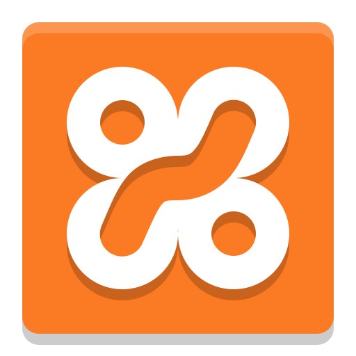
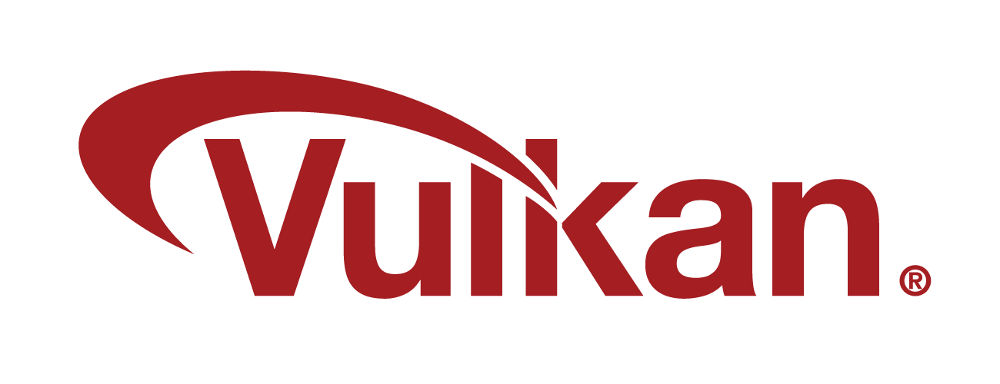

## Magdalena Martínez Sánchez🍄

### **`Computer Engineer & CyberSecurity Master Student in UPM`**

I'm Magdalena Martinez Sanchez, a graduate in Computer Engineering from Huelva University. I have also participated in an Erasmus Exchange program at the University of Epitech in Paris. This experience allowed me to enhance my programming skills, particularly in C, and gain proficiency in Graphical Programming and Cybersecurity.

Additionally, I have developed a full-stack web application as part of my academic projects. I am particularly interested in cybersecurity, web development (both frontend and backend), software development, 3D animations with Blender, and game development with Unity. I have personal experience in all these areas.

**My LinkedIn: https://www.linkedin.com/in/magdalena-martinez-sanchez/**

---

## Languages and Tools⭐

<!--
**magdalenamartinez/magdalenamartinez** is a ✨ _special_ ✨ repository because its `README.md` (this file) appears on your GitHub profile.

Here are some ideas to get you started:

- 🔭 I’m currently working on ...
- 🌱 I’m currently learning ...
- 👯 I’m looking to collaborate on ...
- 🤔 I’m looking for help with ...
- 💬 Ask me about ...
- 📫 How to reach me: ...
- 😄 Pronouns: ...
- ⚡ Fun fact: ...
-->

